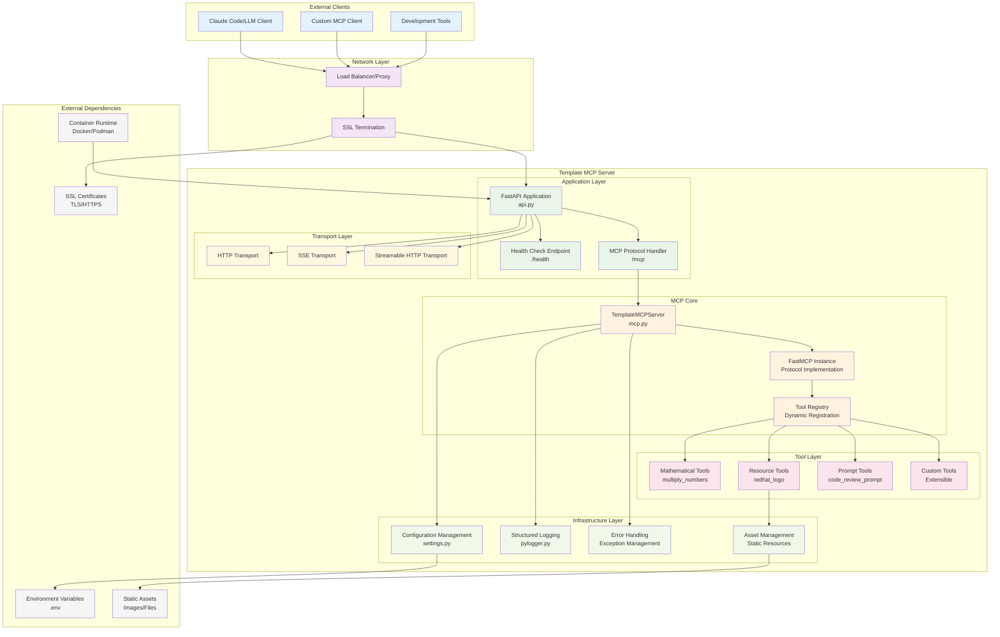
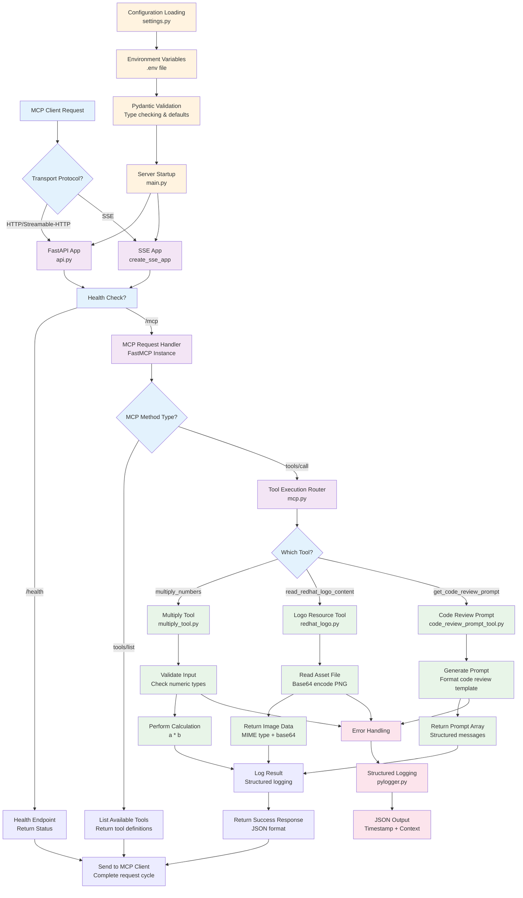

# Template MCP Server

[](https://www.python.org/downloads/)
[](https://github.com/redhat-data-and-ai/template-mcp-server/actions/workflows/ci.yml)
[](https://codecov.io/gh/redhat-data-and-ai/template-mcp-server)
[](https://opensource.org/licenses/Apache-2.0)

## Description

A production-ready template for developing Model Context Protocol (MCP) servers using Python and FastMCP. This server provides a foundation for creating MCP-compliant servers with comprehensive examples of tools, structured logging, configuration management, and containerized deployment.

The template includes three example MCP tools: a multiply calculator, a code review prompt generator, and a Red Hat logo resource handler. It demonstrates best practices for MCP server development including proper error handling, health checks, multiple transport protocols (HTTP, SSE, streamable-HTTP), SSL support, and comprehensive development tooling.

## Architecture

### System Architecture



### Control Flow



## Code Structure

```
template-mcp-server/
├── template_mcp_server/           # Main package directory
│   ├── __init__.py
│   ├── src/                       # Core source code
│   │   ├── __init__.py
│   │   ├── main.py               # Application entry point & startup logic
│   │   ├── api.py                # FastAPI application & transport setup
│   │   ├── mcp.py                # MCP server implementation & tool registration
│   │   ├── settings.py           # Pydantic-based configuration management
│   │   └── tools/                # MCP tool implementations
│   │       ├── __init__.py
│   │       ├── multiply_tool.py  # Mathematical operations tool
│   │       ├── code_review_prompt_tool.py  # Code review prompt generator
│   │       ├── redhat_logo.py    # Base64 image resource handler
│   │       └── assets/           # Static resource files
│   │           └── redhat.png    # Example image asset
│   └── utils/                    # Shared utilities
│       ├── __init__.py
│       └── pylogger.py          # Structured logging with structlog
├── tests/                        # Comprehensive test suite (81+ tests)
│   ├── __init__.py              # Test package initialization
│   ├── conftest.py              # Pytest fixtures and configuration
│   ├── test_multiply_tool.py    # Unit tests for multiply tool (12 tests)
│   ├── test_redhat_logo.py      # Unit tests for logo tool (10 tests)
│   ├── test_code_review_prompt.py  # Unit tests for prompt tool (14 tests)
│   ├── test_settings.py         # Unit tests for configuration (20 tests)
│   ├── test_mcp_server.py       # Unit tests for MCP server (15 tests)
│   └── test_integration.py      # Integration tests (10 tests)
├── pyproject.toml               # Project metadata & dependencies
├── Containerfile               # Red Hat UBI-based container build
├── compose.yaml                # Docker Compose orchestration
├── .env.example                # Environment configuration template
├── .gitignore                  # Version control exclusions
├── .pre-commit-config.yaml     # Code quality automation
└── README.md                   # Project documentation
```

### Key Components

- **`main.py`**: Application entry point with configuration validation, error handling, and uvicorn server startup
- **`api.py`**: FastAPI application setup with transport protocol selection (HTTP/SSE/streamable-HTTP) and health endpoints
- **`mcp.py`**: Core MCP server class that registers tools using FastMCP decorators
- **`settings.py`**: Environment-based configuration using Pydantic BaseSettings with validation
- **`tools/`**: MCP tool implementations demonstrating arithmetic, prompts, and resource access patterns
- **`utils/pylogger.py`**: Structured JSON logging using structlog with comprehensive processors

### Current MCP Tools

1. **`multiply_numbers`**: Demonstrates basic arithmetic operations with error handling
2. **`read_redhat_logo_content`**: Shows resource access patterns with base64 encoding
3. **`get_code_review_prompt`**: Illustrates prompt generation for code analysis

## How to Run the Code Locally

### Prerequisites

- Python 3.12 or higher
- [uv](https://docs.astral.sh/uv/) (fast Python package installer and resolver)

### Setup

1. **Install uv (if not already installed):**
   ```bash
   # On macOS/Linux:
   curl -LsSf https://astral.sh/uv/install.sh | sh

   # On MacOS using brew
   brew install uv

   # On Windows:
   powershell -c "irm https://astral.sh/uv/install.ps1 | iex"

   # Or with pip:
   pip install uv
   ```

2. **Clone the repository:**
   ```bash
   git clone https://github.com/redhat-data-and-ai/template-mcp-server
   cd template-mcp-server
   ```

3. **Create and activate a virtual environment with uv:**
   ```bash
   uv venv

   # Activate the virtual environment:
   # On macOS/Linux:
   source .venv/bin/activate

   # On Windows:
   .venv\Scripts\activate
   ```

4. **Install the package and dependencies:**
   ```bash
   # Install in editable mode with all dependencies
   uv pip install -e .
   ```

5. **Configure environment variables:**
   ```bash
   cp .env.example .env
   # Edit .env file with your configuration
   ```

6. **Run the server:**
   ```bash
   # Using the installed console script
   template-mcp-server

   # Or directly with Python module
   python -m template_mcp_server.src.main

   # Or using uv to run directly
   uv run python -m template_mcp_server.src.main
   ```

### Configuration Options

The server configuration is managed through environment variables:

| Variable | Default | Description |
|----------|---------|-------------|
| `MCP_HOST` | `0.0.0.0` | Server bind address |
| `MCP_PORT` | `3000` | Server port (1024-65535) |
| `MCP_TRANSPORT_PROTOCOL` | `streamable-http` | Transport protocol (`http`, `sse`, `streamable-http`) |
| `MCP_SSL_KEYFILE` | `None` | SSL private key file path |
| `MCP_SSL_CERTFILE` | `None` | SSL certificate file path |
| `PYTHON_LOG_LEVEL` | `INFO` | Logging level (`DEBUG`, `INFO`, `WARNING`, `ERROR`, `CRITICAL`) |

### Using Podman

1. **Build and run with Podman Compose:**
   ```bash
   podman-compose up --build
   ```

2. **Or build manually:**
   ```bash
   podman build -t template-mcp-server .
   podman run -p 3000:3000 --env-file .env template-mcp-server
   ```

### Verify Installation

1. **Health check:**
   ```bash
   curl http://localhost:3000/health
   ```

2. **Test MCP tools:**
   ```bash
   # Test multiply tool via MCP endpoint
   curl -X POST "http://localhost:3000/mcp" \
        -H "Content-Type: application/json" \
        -d '{"method": "tools/call", "params": {"name": "multiply_numbers", "arguments": {"a": 5, "b": 3}}}'
   ```

## How to Test the Code Locally

### Development Environment Setup

1. **Install development dependencies:**
   ```bash
   uv pip install -e ".[dev]"
   ```

2. **Install pre-commit hooks:**
   ```bash
   pre-commit install
   ```

### Running Tests

The project includes a comprehensive test suite with 81+ tests covering unit tests, integration tests, and various edge cases.

1. **Run all tests:**
   ```bash
   pytest
   ```

2. **Run tests with coverage reporting:**
   ```bash
   pytest --cov=template_mcp_server --cov-report=html --cov-report=term
   ```

3. **Run tests by category:**
   ```bash
   # Unit tests only
   pytest -m unit

   # Integration tests only
   pytest -m integration

   # Slow running tests
   pytest -m slow

   # Tests requiring network access
   pytest -m network
   ```

4. **Run specific test modules:**
   ```bash
   # Test individual components
   pytest tests/test_multiply_tool.py -v
   pytest tests/test_redhat_logo.py -v
   pytest tests/test_code_review_prompt.py -v
   pytest tests/test_settings.py -v
   pytest tests/test_mcp_server.py -v

   # Run integration tests
   pytest tests/test_integration.py -v
   ```

5. **Run tests with different output formats:**
   ```bash
   # Verbose output with detailed test names
   pytest -v

   # Short traceback format
   pytest --tb=short

   # Quiet output (minimal)
   pytest -q
   ```

### Code Quality Checks

1. **Linting and formatting with Ruff:**
   ```bash
   # Check for issues
   ruff check .

   # Auto-fix issues
   ruff check . --fix

   # Format code
   ruff format .
   ```

2. **Type checking with MyPy:**
   ```bash
   mypy template_mcp_server/
   ```

3. **Docstring validation:**
   ```bash
   pydocstyle template_mcp_server/ --convention=google
   ```

4. **Run all pre-commit checks:**
   ```bash
   pre-commit run --all-files
   ```

### Test Suite Overview

The project includes a comprehensive test suite with the following structure:

| Test Category | Count | Description |
|---------------|-------|-------------|
| **Unit Tests** | 71 | Individual component testing with mocking |
| **Integration Tests** | 10 | End-to-end workflow testing |
| **Total Tests** | 81+ | Complete test coverage |

**Test Files:**
- `test_multiply_tool.py` - 12 tests covering arithmetic operations, edge cases, error handling
- `test_redhat_logo.py` - 10 tests covering async file operations, base64 encoding, error scenarios
- `test_code_review_prompt.py` - 14 tests covering prompt generation, multiple languages, formatting
- `test_settings.py` - 20 tests covering configuration, environment variables, validation
- `test_mcp_server.py` - 15 tests covering server initialization, tool registration, error handling
- `test_integration.py` - 10 tests covering complete workflows and system integration

**Test Features:**
- ✅ Comprehensive error handling validation
- ✅ Async function testing support
- ✅ Mock external dependencies
- ✅ Environment isolation with fixtures
- ✅ Performance testing for large data
- ✅ Concurrent usage simulation
- ✅ Configuration validation testing

### Manual Testing

1. **Container testing:**
   ```bash
   docker-compose up -d
   curl -f http://localhost:3000/health
   docker-compose down
   ```

2. **SSL testing (if configured):**
   ```bash
   curl -k https://localhost:3000/health
   ```

## Continuous Integration & Deployment

This project uses GitHub Actions for automated CI/CD workflows to ensure code quality, security, and reliability.

### CI/CD Workflows

| Workflow | Trigger | Purpose |
|----------|---------|---------|
| **CI** | Push to main, PRs | Run tests, linting, type checking, security scans |
| **Dependency Updates** | Weekly schedule | Automated dependency updates and security audits |

### CI Pipeline Features

**✅ Code Quality Assurance:**
- Multi-Python version testing (3.12, 3.13)
- Comprehensive test suite execution (81+ tests)
- Code coverage reporting (80%+ requirement)
- Ruff linting and formatting validation
- MyPy type checking
- Docstring validation with pydocstyle

**✅ Security & Compliance:**
- Bandit security linting
- Safety dependency vulnerability scanning

**✅ Automation & Maintenance:**
- Dependabot configuration for automated dependency updates
- Pre-commit hook automation
- Weekly security audits
- Automated PR creation for dependency updates

### Running CI Checks Locally

Before pushing code, run the same checks that CI runs:

```bash
# Install development dependencies
uv pip install -e ".[dev]"

# Run all pre-commit checks
pre-commit run --all-files

# Run tests with coverage
pytest --cov=template_mcp_server --cov-fail-under=80

# Run security checks
bandit -r template_mcp_server/
safety check

# Build and test container
docker build -t template-mcp-server .
docker run --rm template-mcp-server python -c "import template_mcp_server; print('OK')"
```

### Branch Protection

The `main` branch is protected with the following requirements:
- All CI checks must pass
- Pull request reviews required
- Up-to-date branches required
- No direct pushes to main

## How to Contribute

### Development Workflow

1. **Fork and clone:**
   ```bash
   git fork <repository-url>
   git clone <your-fork-url>
   cd template-mcp-server
   ```

2. **Create feature branch:**
   ```bash
   git checkout -b feature/your-feature-name
   ```

3. **Set up development environment:**
   ```bash
   uv venv
   source .venv/bin/activate  # On Windows: .venv\Scripts\activate
   uv pip install -e ".[dev]"
   pre-commit install
   ```

4. **Make changes following our standards**

5. **Run comprehensive testing:**
   ```bash
   # Code quality
   ruff check . --fix
   ruff format .
   mypy template_mcp_server/

   # Tests
   pytest --cov=template_mcp_server

   # Pre-commit validation
   pre-commit run --all-files
   ```

6. **Commit and push:**
   ```bash
   git add .
   git commit -m "feat: descriptive commit message"
   git push origin feature/your-feature-name
   ```

7. **Create Pull Request**

### Coding Standards

- **Python Style**: Follow PEP 8 (enforced by Ruff)
- **Type Annotations**: Required for all public functions and methods
- **Documentation**: Google-style docstrings for all public APIs
- **Testing**: Write tests for new functionality with pytest
- **Commits**: Use conventional commit format (`feat:`, `fix:`, `docs:`, etc.)
- **Error Handling**: Use structured logging and proper exception handling

### Adding New MCP Tools

1. **Create tool module:**
   ```python
   # template_mcp_server/src/tools/your_tool.py
   async def your_tool_function(param: str) -> dict:
       """Your tool description.

       Args:
           param: Parameter description.

       Returns:
           dict: Result dictionary.
       """
       # Implementation here
       return {"result": "success"}
   ```

2. **Register in MCP server:**
   ```python
   # In template_mcp_server/src/mcp.py
   from template_mcp_server.src.tools.your_tool import your_tool_function

   def _register_mcp_tools(self) -> None:
       self.mcp.tool()(your_tool_function)  # Add this line
   ```

3. **Add tests:**
   ```python
   # tests/test_your_tool.py
   import pytest
   from template_mcp_server.src.tools.your_tool import your_tool_function

   @pytest.mark.asyncio
   async def test_your_tool():
       result = await your_tool_function("test_param")
       assert result["result"] == "success"
   ```

4. **Update documentation**

### Adding New Resources

1. **Place assets in:** `template_mcp_server/src/tools/assets/`
2. **Create resource handler in:** `template_mcp_server/src/tools/`
3. **Register in:** `template_mcp_server/src/mcp.py`
4. **Add tests and documentation**

### Code Review Guidelines

- All changes require pull request review
- Automated checks must pass (tests, linting, type checking)
- Documentation should be updated for user-facing changes
- Breaking changes require discussion and versioning consideration

### Getting Help

- **Issues**: Open GitHub issues for bugs or feature requests
- **Discussions**: Use GitHub Discussions for questions
- **Documentation**: Check existing docs and code examples
- **Testing**: Provide minimal reproduction cases for bugs
