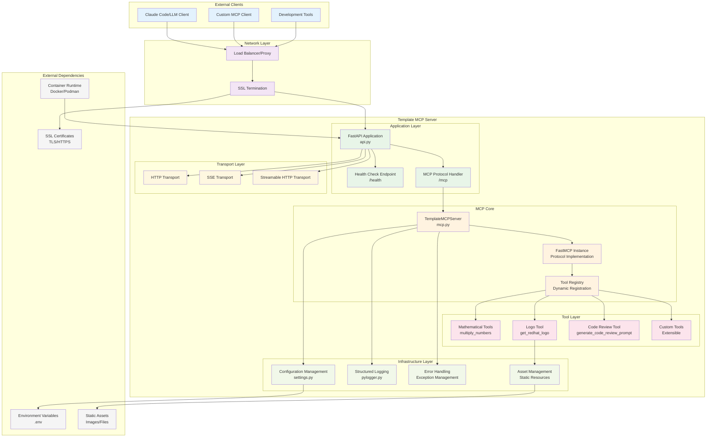
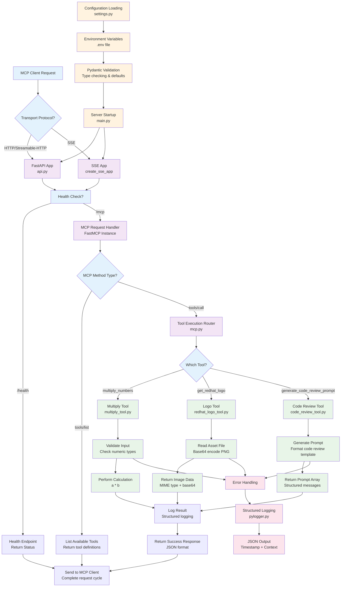

# Architecture

## System Architecture



## Control Flow



## Code Structure

```
template-mcp-server/
├── template_mcp_server/           # Main package directory
│   ├── __init__.py
│   ├── src/                       # Core source code
│   │   ├── __init__.py
│   │   ├── main.py               # Application entry point & startup logic
│   │   ├── api.py                # FastAPI application & transport setup
│   │   ├── mcp.py                # MCP server implementation & tool registration
│   │   ├── settings.py           # Pydantic-based configuration management
│   │   ├── assets/               # Static resource files
│   │   │   └── redhat.png        # Example image asset
│   │   ├── oauth/                # OAuth integration
│   │   │   ├── __init__.py
│   │   │   ├── controller.py     # OAuth controller logic
│   │   │   ├── handler.py        # OAuth request handlers
│   │   │   ├── models.py         # OAuth data models
│   │   │   ├── routes.py         # OAuth route definitions
│   │   │   └── service.py        # OAuth service layer
│   │   ├── storage/              # Persistent storage
│   │   │   ├── __init__.py
│   │   │   └── storage_service.py # PostgreSQL token storage
│   │   └── tools/                # MCP tool implementations
│   │       ├── __init__.py
│   │       ├── multiply_tool.py          # Mathematical operations tool
│   │       ├── code_review_tool.py       # Code review prompt generator
│   │       └── redhat_logo_tool.py       # Base64 image resource handler
│   └── utils/                    # Shared utilities
│       ├── __init__.py
│       └── pylogger.py          # Structured logging with structlog
├── tests/                        # Comprehensive test suite
│   ├── conftest.py              # Pytest fixtures and configuration
│   ├── test_api.py              # API endpoint tests
│   ├── test_basic.py            # Basic integration tests
│   ├── test_main.py             # Entry point tests
│   ├── test_mcp.py              # MCP server tests
│   ├── test_oauth_controller.py # OAuth controller tests
│   ├── test_oauth_handler.py    # OAuth handler tests
│   ├── test_oauth_service.py    # OAuth service tests
│   ├── test_settings.py         # Configuration tests
│   ├── test_storage_init.py     # Storage init tests
│   ├── test_storage_service.py  # Storage service tests
│   ├── test_tools.py            # Tool unit tests
│   └── test_utils.py            # Utility tests
├── examples/                     # Client examples
│   ├── fastmcp_client.py        # FastMCP client example
│   └── langgraph_client.py      # LangGraph client example
├── deployment/                   # Deployment configurations
│   └── openshift/               # OpenShift manifests
├── .github/                      # GitHub configuration
│   ├── ISSUE_TEMPLATE/          # Issue templates
│   ├── PULL_REQUEST_TEMPLATE.md # PR template
│   ├── dependabot.yml           # Dependency automation
│   ├── labeler.yml              # Auto-labeling rules
│   └── workflows/               # CI/CD workflows
├── pyproject.toml               # Project metadata & dependencies
├── Makefile                     # Development commands
├── Containerfile                # Red Hat UBI-based container build
├── compose.yaml                 # Podman/Docker Compose orchestration
├── CONTRIBUTING.md              # Contribution guide
├── SECURITY.md                  # Security policy
├── CHANGELOG.md                 # Release history
├── LICENSE                      # Apache 2.0
└── README.md                    # Project documentation
```

## Key Components

- **`main.py`**: Application entry point with configuration validation, error handling, and uvicorn server startup
- **`api.py`**: FastAPI application setup with transport protocol selection (HTTP/SSE/streamable-HTTP) and health endpoints
- **`mcp.py`**: Core MCP server class that registers tools using FastMCP decorators
- **`settings.py`**: Environment-based configuration using Pydantic BaseSettings with validation
- **`tools/`**: MCP tool implementations demonstrating arithmetic, prompts, and resource access patterns
- **`utils/pylogger.py`**: Structured JSON logging using structlog with comprehensive processors

## Current MCP Tools

1. **`multiply_numbers`**: Demonstrates basic arithmetic operations with error handling
2. **`get_redhat_logo`**: Shows resource access patterns with base64 encoding
3. **`generate_code_review_prompt`**: Illustrates prompt generation for code analysis
