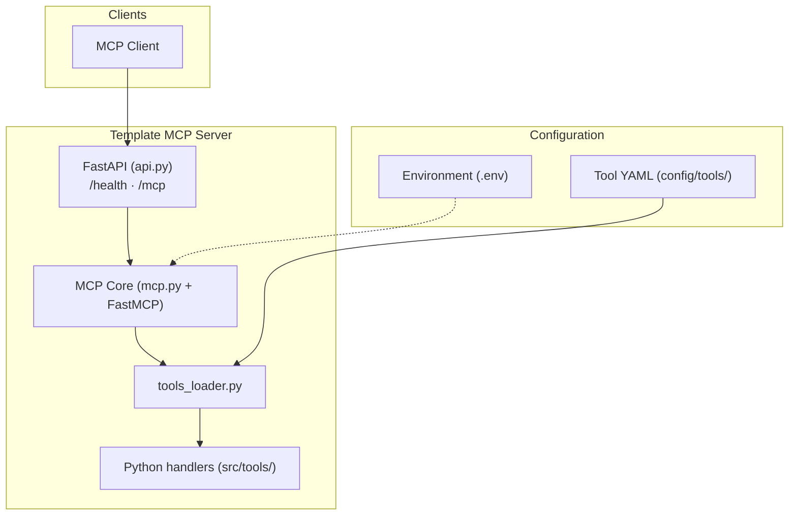
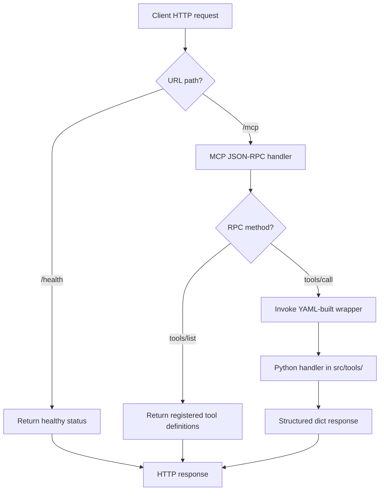
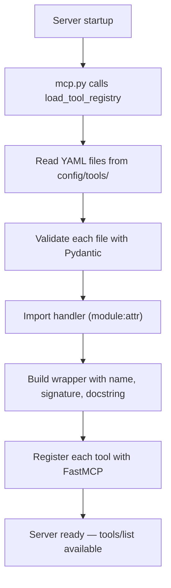
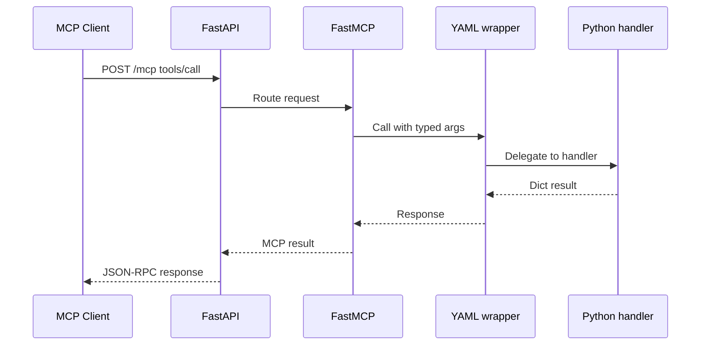

# Architecture

## Overview

High-level view of the template MCP server. Details are broken out in the zoom-in diagrams below.


```mermaid
flowchart TB
    subgraph clients [Clients]
        Client[MCP Client]
    end

    subgraph server [Template MCP Server]
        API["FastAPI (api.py)<br/>/health · /mcp"]
        Core["MCP Core (mcp.py + FastMCP)"]
        Loader[tools_loader.py]
        Handlers["Python handlers (src/tools/)"]
    end

    subgraph config [Configuration]
        YAML["Tool YAML (config/tools/)"]
        Env["Environment (.env)"]
    end

    Client --> API
    API --> Core
    Core --> Loader
    YAML --> Loader
    Loader --> Handlers
    Env -.-> Core
```

| Box | Role |
|-----|------|
| **FastAPI** | HTTP entry point — health checks and MCP JSON-RPC |
| **MCP Core** | FastMCP server instance; registers tools at startup |
| **tools_loader.py** | Reads YAML, imports handlers, builds callables |
| **config/tools/** | Tool surface — name, params, metadata, `handler` |
| **src/tools/** | Tool behavior — validation, logic, return dict |
| **.env** | Host, port, auth, secrets (not tool definitions) |

## Zoom-in: Request path

What happens when a client sends an HTTP request:


```mermaid
flowchart TD
    Req[Client HTTP request] --> Path{URL path?}

    Path -->|/health| Health[Return healthy status]
    Path -->|/mcp| Rpc[MCP JSON-RPC handler]

    Rpc --> Method{RPC method?}

    Method -->|tools/list| List[Return registered tool definitions]
    Method -->|tools/call| Call[Invoke YAML-built wrapper]

    Call --> Handler[Python handler in src/tools/]
    Handler --> Result[Structured dict response]

    Health --> Done[HTTP response]
    List --> Done
    Result --> Done
```

Transport selection (HTTP, SSE, streamable-HTTP) is configured via `MCP_TRANSPORT_PROTOCOL` in `api.py`. The request routing above is the same regardless of transport.

## Tools config-as-code

The template separates **tool surface** (YAML) from **tool behavior** (Python). This mirrors the config-as-code pattern used by `template-agent`: operational definitions live in config files; the runtime loads them at startup.

| Layer | Location | Responsibility |
|-------|----------|----------------|
| Tool surface | `config/tools/*.yaml` | Name, description, params, agent metadata, `enabled`, `handler` |
| Tool behavior | `src/tools/*.py` | Validation, business logic, structured return dict |
| Loader | `src/tools_loader.py` | Validate YAML, import handler, build FastMCP callable |
| Registration | `src/mcp.py` | Register all enabled tools with FastMCP at startup |
| Secrets / bind | `.env` | Host, port, auth, database — unchanged |

Override the config directory with `MCP_TOOLS_CONFIG_PATH` (for example, an OpenShift ConfigMap mount).

### Zoom-in: Tool loading (startup)

Runs once when `TemplateMCPServer` initializes. Tools with `enabled: false` are skipped.


```mermaid
flowchart TD
    A[Server startup] --> B[mcp.py calls load_tool_registry]
    B --> C[Read YAML files from config/tools/]
    C --> D[Validate each file with Pydantic]
    D --> E["Import handler (module:attr)"]
    E --> F[Build wrapper with name, signature, docstring]
    F --> G[Register each tool with FastMCP]
    G --> H[Server ready — tools/list available]
```

### Zoom-in: Tool invocation (runtime)

Runs on every `tools/call` request:


```mermaid
sequenceDiagram
    participant Client as MCP Client
    participant API as FastAPI
    participant FastMCP as FastMCP
    participant Wrapper as YAML wrapper
    participant Handler as Python handler

    Client->>API: POST /mcp tools/call
    API->>FastMCP: Route request
    FastMCP->>Wrapper: Call with typed args
    Wrapper->>Handler: Delegate to handler
    Handler-->>Wrapper: Dict result
    Wrapper-->>FastMCP: Response
    FastMCP-->>API: MCP result
    API-->>Client: JSON-RPC response
```

**Adding a tool** requires only a handler file and a YAML config — no changes to `mcp.py`. See the [Tutorial](tutorial.md).

## Code Structure

```
template-mcp-server/
├── template_mcp_server/           # Main package directory
│   ├── __init__.py
│   ├── config/                    # Tool config-as-code (YAML)
│   │   └── tools/                 # One YAML file per tool
│   │       ├── multiply_numbers.yaml
│   │       ├── generate_code_review_prompt.yaml
│   │       ├── get_redhat_logo.yaml
│   │       └── README.md
│   ├── src/                       # Core source code
│   │   ├── __init__.py
│   │   ├── main.py               # Application entry point & startup logic
│   │   ├── api.py                # FastAPI application & transport setup
│   │   ├── mcp.py                # MCP server — registers tools from loader
│   │   ├── tools_loader.py       # Load YAML configs, build FastMCP callables
│   │   ├── settings.py           # Pydantic-based configuration management
│   │   ├── assets/               # Static resource files
│   │   │   └── redhat.png        # Example image asset
│   │   ├── oauth/                # OAuth integration
│   │   │   ├── __init__.py
│   │   │   ├── controller.py     # OAuth controller logic
│   │   │   ├── handler.py        # OAuth request handlers
│   │   │   ├── models.py         # OAuth data models
│   │   │   ├── routes.py         # OAuth route definitions
│   │   │   └── service.py        # OAuth service layer
│   │   ├── storage/              # Persistent storage
│   │   │   ├── __init__.py
│   │   │   └── storage_service.py # PostgreSQL token storage
│   │   └── tools/                # MCP tool handlers (behavior only)
│   │       ├── __init__.py
│   │       ├── README.md                 # Handler development guide
│   │       ├── multiply_tool.py          # multiply_numbers handler
│   │       ├── code_review_tool.py       # generate_code_review_prompt handler
│   │       └── redhat_logo_tool.py       # get_redhat_logo handler
│   └── utils/                    # Shared utilities
│       ├── __init__.py
│       └── pylogger.py          # Structured logging with structlog
├── tests/                        # Comprehensive test suite
│   ├── conftest.py              # Pytest fixtures and configuration
│   ├── test_api.py              # API endpoint tests
│   ├── test_basic.py            # Basic integration tests
│   ├── test_main.py             # Entry point tests
│   ├── test_mcp.py              # MCP server tests
│   ├── test_oauth_controller.py # OAuth controller tests
│   ├── test_oauth_handler.py    # OAuth handler tests
│   ├── test_oauth_service.py    # OAuth service tests
│   ├── test_settings.py         # Configuration tests
│   ├── test_storage_init.py     # Storage init tests
│   ├── test_storage_service.py  # Storage service tests
│   ├── test_tools.py            # Tool handler unit tests
│   ├── test_tools_loader.py     # YAML loader and registry tests
│   └── test_utils.py            # Utility tests
├── examples/                     # Client examples
│   ├── fastmcp_client.py        # FastMCP client example
│   └── langgraph_client.py      # LangGraph client example
├── deployment/                   # Deployment configurations
│   └── openshift/               # OpenShift manifests
├── .github/                      # GitHub configuration
│   ├── ISSUE_TEMPLATE/          # Issue templates
│   ├── PULL_REQUEST_TEMPLATE.md # PR template
│   ├── dependabot.yml           # Dependency automation
│   ├── labeler.yml              # Auto-labeling rules
│   └── workflows/               # CI/CD workflows
├── pyproject.toml               # Project metadata & dependencies
├── Makefile                     # Development commands
├── Containerfile                # Red Hat UBI-based container build
├── compose.yaml                 # Podman/Docker Compose orchestration
├── CONTRIBUTING.md              # Contribution guide
├── SECURITY.md                  # Security policy
├── CHANGELOG.md                 # Release history
├── LICENSE                      # Apache 2.0
└── README.md                    # Project documentation
```

## Key Components

- **`main.py`**: Application entry point with configuration validation, error handling, and uvicorn server startup
- **`api.py`**: FastAPI application setup with transport protocol selection (HTTP/SSE/streamable-HTTP) and health endpoints
- **`mcp.py`**: Core MCP server class — loads and registers tools from YAML via `tools_loader`
- **`tools_loader.py`**: Reads `config/tools/*.yaml`, imports handlers, builds FastMCP callables with signatures and docstrings
- **`config/tools/`**: Per-tool YAML definitions (name, params, agent metadata, `handler`, `enabled`)
- **`settings.py`**: Environment-based configuration using Pydantic BaseSettings with validation
- **`tools/`**: Python handlers — validation, business logic, structured return dicts (metadata lives in YAML)
- **`oauth/`**: OAuth 2.0 integration — controller, handler, models, routes, service (see [Authentication Guide](authentication.md))
- **`storage/storage_service.py`**: PostgreSQL-backed `StorageService` for persistent token and client storage. Used by the OAuth layer to store authorization codes, access tokens, refresh tokens, and registered clients. Requires PostgreSQL when auth is enabled; initialized at server startup via `oauth/service.py`
- **`utils/pylogger.py`**: Structured JSON logging using structlog with comprehensive processors

## Current MCP Tools

1. **`multiply_numbers`**: Demonstrates basic arithmetic operations with error handling
2. **`get_redhat_logo`**: Shows resource access patterns with base64 encoding
3. **`generate_code_review_prompt`**: Illustrates prompt generation for code analysis

## HTTP Endpoints

The FastAPI application (`api.py`) exposes the following HTTP routes. OAuth routes are registered conditionally when `ENABLE_AUTH=True`.

### Core Routes

| Method | Path | Description |
|--------|------|-------------|
| `GET` | `/health` | Health check — returns `{"status": "healthy"}` |
| `POST` | `/mcp` | MCP JSON-RPC endpoint (tools/list, tools/call, etc.) |
| `GET` | `/.well-known/oauth-protected-resource` | RFC 8414 resource server metadata (auth only) |
| `GET` | `/.well-known/oauth-authorization-server` | RFC 8414 authorization server metadata (auth only) |

### OAuth Routes (prefix: `/auth`)

Registered when `ENABLE_AUTH=True` via `register_oauth_routes()`.

| Method | Path | Description |
|--------|------|-------------|
| `GET` | `/auth/authorize` | Start the authorization code flow |
| `GET` | `/auth/callback/oidc` | OAuth callback — exchanges code for token |
| `POST` | `/auth/token` | Token endpoint (issue / refresh tokens) |
| `POST` | `/auth/register` | Dynamic client registration |
| `POST` | `/auth/introspect` | Token introspection |

> **Note:** The MCP endpoint accepts JSON-RPC requests. `tools/list` is exempt from auth so that agents can discover tools without a token; `tools/call` requires a valid bearer token.

## Error Handling

The server uses a layered error handling strategy:

| Layer | Mechanism | Example |
|-------|-----------|---------|
| **Startup** | `main.py` validates settings and catches `SystemExit`, `KeyboardInterrupt`, and unexpected exceptions before the event loop starts | Missing required env var → logged + exit(1) |
| **Middleware** | `AuthorizationMiddleware` / `LocalDevelopmentAuthorizationMiddleware` intercept requests and return `401` or `403` JSON responses for invalid or missing tokens | Expired bearer token → `{"detail": "Unauthorized"}` |
| **Health** | `/health` returns `200` with `{"status": "healthy"}` — no auth required | Used by container probes and load balancers |
| **Tool-level** | Each MCP tool validates its own inputs (type checks, value ranges) and raises descriptive errors that the MCP protocol returns to the client | `multiply_numbers` with non-numeric input → error message in MCP response |
| **OAuth** | OAuth controller methods catch provider errors and return appropriate OAuth error responses (`invalid_grant`, `invalid_client`, etc.) | Bad authorization code → `{"error": "invalid_grant"}` |
| **Logging** | All layers log via structlog with JSON output, including request IDs and error context | Structured `error` level entries with stack traces |
